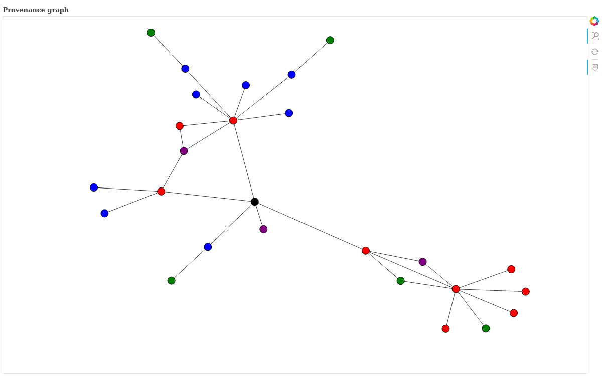

# Provenance Graphs for News Articles

## Table of Contents 
1. Introduction<br/>
2. Installation <br/>
3. How to Run <br/>

## Introduction
The original code was written by Ying-Ke Chin-Lee in 2017.
Jeanette worked on forks of this repo (https://github.com/jeanettejohnson/prov-cpl) during a directed studies at UBC in Winter 2019.  

For more information on the concept of data provenance, check out [A Primer on Provenance](https://dl.acm.org/citation.cfm?id=2602651). The purpose of this module is to extract provenance from online news articles and to store and visualize it in a meaningful way. It attempts this by taking an article and generating a graph or matrix representing a collection of the authors, quotes, and linked articles related to the base article mapping the relationships between them. The ultimate goal is to address the question of whether provenance can be used to distinguish "Fake News" from real news. 

## Installation
In order to run the end-to-end pipeline to generate a provenance graph for an article, there are a few dependencies that need to be installed first. Here is a step-by-step guide to installing everything you'll need to run this project.

1. Clone this repository: `git clone https://github.com/margoseltzer/article-scraping.git`

2. Download and install the Prov-CPL library and Python bindings, as well as their dependencies (https://github.com/margoseltzer/prov-cpl)
	#### A few slight changes to the installation process
	* When configuring the database, run the command `sudo psql -U postgres postgres < scripts/postgresql-setup.sql`
	* If you are having linking issues during compilation (and you are on unix), run `set LD_LIBRARY_PATH="/usr/local/lib"`. If this does not work, try setting it [like this](https://stackoverflow.com/questions/13428910/how-to-set-the-environmental-variable-ld-library-path-in-linux)
	
3. Resolve dependencies in `provgeneration/prov_genertor.py`, `scraper.py`, `graphing\interactive_graph.py`, `graphing\graph_builder.py`. 
Some of the Python3 packages you will need are:
```
	https://stanfordnlp.github.io/CoreNLP/download.html, version 3.9.2
	    - In ``src/scraper.py``, modify the ``stanfordLibrary`` variable definition so that it points towards your downloaded library
	https://github.com/misja/python-boilerpipe
	nltk              version 3.4.4
	subprocess
	newspaper3k       version 0.2.8
	bs4               version 4.7.1
	stanfordcorenlp
	re                version 2.2.1
	networkx          version 2.3
	bokeh             version 1.2.0
```

The Python2 packages you will need are:
```
	googlesearch
	nltk            version 3.2.1
	bs4             version 4.7.1
	urllib2         version 2.7
	threading
```

4. Start the PostgreSQL server you installed in step 2: `sudo /etc/init.d/postgresql start`. Verify that it says [OK] and accepts connections on port 5432 (or whichever port you configured it to listen on). 

5. (Optional) Download and install a PostgreSQL Database Visualizer. I like pgAdmin: https://www.pgadmin.org/. Connect to the running DB with username postgres and verify that the DB has been set up correctly and you can navigate between tables. There won't be anything there yet as you are running it locally.

6. `src/provgeneration/prov_generator.py` needs to be run using python 2, while the rest of the project depends on python 3/Anaconda. This is because provgenerator is the file with dependencies to prov-cpl, and the cpl python bindings strictly support 2.7.


## How to Run
Here is a walk through of how to generate a prov graph, using [this BBC Facebook article](https://www.bbc.com/news/world-us-canada-48972327). A short summary of the relevant commands and files can be found below this section.
First, run the web scraper module to look at the article HTML and pull out relevant items such as authors, quotes, and links to other articles.  
The scraper takes in various arguments:  
 ``-u`` to specify a single url  
 ``-f`` to pass in a file containing a list of urls. The file should be a csv with a column named 'url', that contains the list of urls you want to scrape.
 ``-d`` to specify the depth to scrape to (referenced articles are scraped recursively). This defaults to depth 2.  
 ``-o`` to specify the output file  
```
python3 src/scraper.py -u https://www.bbc.com/news/world-us-canada-48972327 -d 2 -o fileName.json
```
 
The information will be written in JSON format to the output file, and will have the following fields:
```json
[
    {
        "url": "https://www.bbc.com/news/world-us-canada-48972327",
        "title": "Facebook 'to be fined $5bn over Cambridge Analytica scandal'",
        "authors": [],
        "publisher": "www.bbc.com",
        "publish_date": "",
        "text": "Media playback is unsupported on your device Media caption How the Facebook-Cambridge Analytica data scandal unfolded\n\nUS regulators have approved a record $5bn (£4bn) fine on Facebook to settle an investigation into data privacy violations, reports in US media say.\n\nThe Federal Trade Commission (FTC) has been investigating allegations that political consultancy Cambridge Analytica improperly obtained the data of up to 87 million Facebook users.\n\nThe settlement was approved by the FTC in a 3-2 vote, sources told US media.\n\nFacebook and the FTC told the BBC they had no comment on the reports.\n\nHow was the settlement reached?\n\nThe consumer protection agency the FTC began investigating Facebook in March 2018 following reports that Cambridge Analytica had accessed the data of tens of millions of its users.\n\nThe investigation focused on whether Facebook had violated a 2011 agreement under which it was required to clearly notify users and gain \"express consent\" to share their data.\n\nThe $5bn fine was approved by the FTC in a 3-2 vote which broke along party lines, with Republican commissioners in favour and Democrats opposed.\n\nThe New York Times reported that the Democrats wanted stricter limits on the firm, while other Democrats have criticised the fine as inadequate.\n\n\"With the FTC either unable or unwilling to put in place reasonable guardrails to ensure that user privacy and data are protected, it's time for Congress to act,\" US Senator Mark Warner said.\n\nThe fine still needs to be finalised by the Justice Department's civil division, and it is unclear how long this may take, the sources said.\n\nIf confirmed, it would be the largest fine ever levied by the FTC on a tech company.\n\nHowever, the amount falls in line with estimates by Facebook, which earlier this year said it was expecting a fine of up to $5bn.\n\nInvestors responded positively to the news, pushing Facebook shares up 1.8%.\n\nFacebook has been expecting this\n\nAnalysis by Dave Lee, BBC North America technology reporter in San Francisco\n\nFacebook had been expecting this. It told investors back in April that it had put aside most of the money, which means the firm won't feel much added financial strain from this penalty.\n\nWhat we don't yet know is what additional measures may be placed on the company, such as increased privacy oversight, or if there will be any personal repercussions for the company's chief executive, Mark Zuckerberg.\n\nThe settlement, which amounts to around one quarter of the company's yearly profit, will reignite criticism from those who say this amounts to little more than a slap on the wrist.\n\nWhat was the Cambridge Analytica scandal?\n\nCambridge Analytica was a British political consulting firm that had access to the data of millions of users, some of which was allegedly used to psychologically profile US voters and target them with material to help Donald Trump's 2016 presidential campaign.\n\nThe data was acquired via a quiz, which invited users to find out their personality type.\n\nAs was common with apps and games at that time, it was designed to harvest not only the user data of the person taking part in the quiz, but also the data of their friends.\n\nFacebook has said it believes the data of up to 87 million users was improperly shared with the now defunct consultancy.\n\nThe scandal sparked several investigations around the world.\n\nIn October, Facebook was fined £500,000 by the UK's data protection watchdog, which said the company had let a \"serious breach\" of the law take place.\n\nCanada's data watchdog earlier this year said Facebook had committed \"serious contraventions\" of its privacy laws.",
        "quotes": [
            [
                "With the FTC either unable or unwilling to put in place reasonable guardrails to ensure that user privacy and data are protected, it's time for Congress to act,",
                "Mark Warner",
                true
            ]
        ],
        "links": {
            "articles": [
                "https://www.bbc.co.uk/news/business-48045138",
                "https://www.nytimes.com/2019/07/12/technology/facebook-ftc-fine.html?action=click&module=Top%20Stories&pgtype=Homepage",
                "https://www.bbc.co.uk/news/technology-45976300"
            ],
            "gov_pgs": [],
            "unsure": []
        },
        "key_words": [
            "5bn",
            "data",
            "told",
            "scandal",
            "fine",
            "privacy",
            "ftc",
            "media",
            "facebook",
            "settlement",
            "users",
            "analytica",
            "cambridge",
            "fined"
        ]
    },
    {
        "url": "https://www.bbc.co.uk/news/business-48045138",
        "title": "Facebook sets aside $3bn for privacy probe",
        "authors": [],
        "publisher": "www.bbc.co.uk",
        "publish_date": "",
        "text": "Image copyright Reuters\n\nFacebook has said it will set aside $3bn (£2.3bn) to cover the potential costs of an investigation by US authorities into its privacy practices.\n\nWhile it has provided for a heavy toll from the investigation by the US Federal Trade Commission, the final cost could be $5bn, it said.\n\nThe social media giant also said total sales for the first three months of the year leapt 26% to $15.08bn, narrowly beating market expectations.\n\nMonthly users rose 8%, it said.\n\nThat rise takes the number of users to 2.38 billion.\n\n\"We had a good quarter and our business and community continued to grow,\" founder and chief executive Mark Zuckerberg said.\n\n\"We are focused on building out our privacy-focused vision for the future of social networking, and working collaboratively to address important issues around the internet.\"\n\nShares rise\n\nThe shares are up by nearly 40% in the year to date, far outperforming the broader market, and were up nearly 5% in late trading on Wall Street.\n\nFacebook is facing a probe over the Cambridge Analytica data scandal, however no findings have yet been published.\n\nFacebook was labelled \"morally bankrupt pathological liars\" by New Zealand's privacy commissioner this month after hosting a livestream of the Christchurch attacks that left 50 dead.\n\nIn an interview after the attacks, Mr Zuckerberg refused to commit to any changes to the platform's live technology, including a time delay on livestreams.\n\nFacebook, which owns Instagram, last week admitted that millions more Instagram users were affected by a security lapse than it had previously disclosed. It had mistakenly stored the passwords of hundreds of millions of users without encryption.",
        "quotes": [
            [
                "We had a good quarter and our business and community continued to grow,",
                "",
                true
            ],
            [
                "We are focused on building out our privacy-focused vision for the future of social networking, and working collaboratively to address important issues around the internet.",
                "",
                true
            ]
        ],
        "links": {
            "articles": [],
            "gov_pgs": [],
            "unsure": []
        },
        "key_words": [
            "investigation",
            "sets",
            "zuckerberg",
            "social",
            "attacks",
            "privacy",
            "facebook",
            "3bn",
            "millions",
            "instagram",
            "nearly",
            "probe",
            "market",
            "users",
            "aside"
        ]
    },
    {
        "url": "https://www.nytimes.com/2019/07/12/technology/facebook-ftc-fine.html?action=click&module=Top%20Stories&pgtype=Homepage",
        "title": "F.T.C. Approves Facebook Fine of About $5 Billion",
        "authors": [
            {
                "name": "Cecilia Kang",
                "link": null
            }
        ],
        "publisher": "www.nytimes.com",
        "publish_date": "2019-07-12",
        "text": "The Federal Trade Commission has approved a fine of roughly $5 billion against Facebook for mishandling users’ personal information, according to three people briefed on the vote, in what would be a landmark settlement that signals a newly aggressive stance by regulators toward the country’s most powerful technology companies.\n\nThe much-anticipated settlement still needs final approval in the coming weeks from the Justice Department, which rarely rejects settlements reached by the agency. It would be the biggest fine by far levied by the federal government against a technology company, easily eclipsing the $22 million imposed on Google in 2012. The size of the penalty underscored the rising frustration among Washington officials with how Silicon Valley giants collect, store and use people’s information.\n\nIt would also represent one of the most aggressive regulatory actions by the Trump administration, and a sign of the government’s willingness to punish one of the country’s biggest and most powerful companies. President Trump has dialed back regulations in many industries, but the Facebook settlement sets a new bar for privacy enforcement by United States officials, who have brought few cases against large technology companies.\n\nIn addition to the fine, Facebook agreed to more comprehensive oversight of how it handles user data, according to the people. But none of the conditions in the settlement will impose strict limitations on Facebook’s ability to collect and share data with third parties. And that decision appeared to help split the five-member commission. The 3-to-2 vote, taken in secret this week, drew the dissent of the two Democrats on the commission because they sought stricter limits on the company, the people said.",
        "quotes": [],
        "links": {
            "articles": [
                "https://www.nytimes.com/2019/04/24/technology/facebook-ftc-fine-privacy.html?module=inline"
            ],
            "gov_pgs": [],
            "unsure": []
        },
        "key_words": [
            "federal",
            "approves",
            "commission",
            "fine",
            "ftc",
            "vote",
            "facebook",
            "officials",
            "settlement",
            "trump",
            "technology",
            "billion",
            "powerful"
        ]
    },
    {
        "url": "https://www.bbc.co.uk/news/technology-45976300",
        "title": "Facebook fined £500,000 for Cambridge Analytica scandal",
        "authors": [],
        "publisher": "www.bbc.co.uk",
        "publish_date": "",
        "text": "Image copyright Getty Images Image caption Facebook's chief executive has repeatedly declined to answer questions from UK MPs about the scandal\n\nFacebook has been fined £500,000 by the UK's data protection watchdog for its role in the Cambridge Analytica data scandal.\n\nThe Information Commissioner's Office (ICO) said Facebook had let a \"serious breach\" of the law take place.\n\nThe fine is the maximum allowed under the old data protection rules that applied before GDPR took effect in May.\n\nThe ICO said Facebook had given app developers access to people's data \"without clear consent\".\n\nIn July, the ICO notified the social network that it intended to issue the maximum fine.\n\nConfirming the fine, it said in a statement: \"Between 2007 and 2014, Facebook processed the personal information of users unfairly by allowing application developers access to their information without sufficiently clear and informed consent, and allowing access even if users had not downloaded the app, but were simply 'friends' with people who had.\"\n\nMedia playback is unsupported on your device Media caption JULY 2018: Ms Denham warns Facebook\n\n\"Facebook also failed to keep the personal information secure because it failed to make suitable checks on apps and developers using its platform.\"\n\nFacebook said it was \"reviewing\" the ICO's decision.\n\n\"While we respectfully disagree with some of their findings, we have said before that we should have done more to investigate claims about Cambridge Analytica and taken action in 2015,\" it said in a statement.\n\nWhat was the Cambridge Analytica data scandal?\n\nResearcher Dr Aleksandr Kogan and his company GSR used a personality quiz to harvest the Facebook data of up to 87 million people.\n\nSome of this data was shared with Cambridge Analytica, which used it to target political advertising in the US.\n\n\"Even after the misuse of the data was discovered in December 2015, Facebook did not do enough to ensure those who continued to hold it had taken adequate and timely remedial action, including deletion,\" the ICO said.\n\nThe ICO found that more than one million people in the UK had their data harvested by the personality quiz.\n\n\"A company of its size and expertise should have known better and it should have done better,\" said Information Commissioner Elizabeth Denham.\n\nThe ICO is still investigating how data analytics is used for political purposes.\n\nMs Denham is due to give evidence to the Department for Digital, Culture, Media and Sport (DCMS) Select Committee on 6 November.",
        "quotes": [
            [
                "Between 2007 and 2014, Facebook processed the personal information of users unfairly by allowing application developers access to their information without sufficiently clear and informed consent, and allowing access even if users had not downloaded the app, but were simply 'friends' with people who had.",
                "",
                true
            ],
            [
                "Facebook also failed to keep the personal information secure because it failed to make suitable checks on apps and developers using its platform.",
                "Denham",
                true
            ],
            [
                "While we respectfully disagree with some of their findings, we have said before that we should have done more to investigate claims about Cambridge Analytica and taken action in 2015,",
                "",
                true
            ],
            [
                "Even after the misuse of the data was discovered in December 2015, Facebook did not do enough to ensure those who continued to hold it had taken adequate and timely remedial action, including deletion,",
                "",
                true
            ],
            [
                "A company of its size and expertise should have known better and it should have done better,",
                "Elizabeth Denham",
                true
            ]
        ],
        "links": {
            "articles": [
                "https://www.bbc.co.uk/news/av/technology-44006602/what-is-gdpr-technology-explained"
            ],
            "gov_pgs": [],
            "unsure": []
        },
        "key_words": [
            "500000",
            "data",
            "access",
            "scandal",
            "ico",
            "facebook",
            "information",
            "users",
            "analytica",
            "developers",
            "used",
            "cambridge",
            "fined"
        ]
    },
    {
        "url": "https://www.nytimes.com/2019/04/24/technology/facebook-ftc-fine-privacy.html?module=inline",
        "title": "Facebook Expects to Be Fined Up to $5 Billion by F.T.C. Over Privacy Issues",
        "authors": [
            {
                "name": "Cecilia Kang",
                "link": null
            },
            {
                "name": "Mike Isaac",
                "link": null
            }
        ],
        "publisher": "www.nytimes.com",
        "publish_date": "2019-04-24",
        "text": "SAN FRANCISCO — Facebook said on Wednesday that it expected to be fined up to $5 billion by the Federal Trade Commission for privacy violations. The penalty would be a record by the agency against a technology company and a sign that the United States was willing to punish big tech companies.\n\nThe social network disclosed the amount in its quarterly financial results, saying it estimated a one-time charge of $3 billion to $5 billion in connection with an “ongoing inquiry” by the F.T.C. Facebook added that “the matter remains unresolved, and there can be no assurance as to the timing or the terms of any final outcome.”\n\nFacebook has been in negotiations with the regulator for months over a financial penalty for claims that the company violated a 2011 privacy consent decree. That year, the social network promised a series of measures to protect its users’ privacy after an investigation found that its handling of data had harmed consumers.\n\nThe F.T.C. opened a new investigation last year after Facebook came under fire again. This time, the company was accused of not protecting its users’ data from being harvested without their consent by Cambridge Analytica, a British political consulting firm that was building voter profiles for the Trump campaign. Facebook also suffered a data breach that exposed the personal information of nearly 50 million users.",
        "quotes": [
            [
                "the matter remains unresolved, and there can be no assurance as to the timing or the terms of any final outcome.",
                "",
                false
            ]
        ],
        "links": {
            "articles": [
                "https://investor.fb.com/investor-news/press-release-details/2019/Facebook-Reports-First-Quarter-2019-Results/default.aspx",
                "https://www.nytimes.com/2018/03/17/us/politics/cambridge-analytica-trump-campaign.html?module=inline",
                "https://www.nytimes.com/2018/09/28/technology/facebook-hack-data-breach.html?module=inline",
                "https://www.nytimes.com/2019/02/14/technology/facebook-ftc-settlement.html?module=inline"
            ],
            "gov_pgs": [],
            "unsure": []
        },
        "key_words": [
            "expects",
            "data",
            "social",
            "privacy",
            "ftc",
            "penalty",
            "facebook",
            "network",
            "company",
            "users",
            "issues",
            "investigation",
            "billion",
            "fined"
        ]
    },
    {
        "url": "https://www.bbc.co.uk/news/av/technology-44006602/what-is-gdpr-technology-explained",
        "title": "What is GDPR? Technology explained",
        "authors": [],
        "publisher": "www.bbc.co.uk",
        "publish_date": "",
        "text": "Video\n\nA new EU law that changes how companies use our personal information kicks in on 25 May.\n\nThe BBC's Chris Foxx explains what GDPR is and how it will affect you.",
        "quotes": [],
        "links": {
            "articles": [],
            "gov_pgs": [],
            "unsure": []
        },
        "key_words": [
            "explains",
            "personal",
            "maythe",
            "kicks",
            "information",
            "law",
            "technology",
            "eu",
            "explained",
            "foxx",
            "videoa",
            "gdpr"
        ]
    }
]
```
Next, run the provenance generator using python 2.7. 
The prov_generator script takes in various arguments:  
 ``-f`` to specify the name of file to process. The result is stored in result stored in file_name_output.json.  
 ``-d`` process all files in a directory, the result is stored in a directory called directory_name_output.   
 ``-o`` to specify the originator. This defaults to ``test``  
 ``-a`` to output result of all files specified in ``-f`` and ``-d`` option into one `output.json` file   
 
 ```
python src/provgeneration/prov_generator.py -f fileName.json
``` 
This module uses the prov-cpl library to create provenance entities and map relationships between them.
The information written to the output file follows the Prov-JSON syntax, documentation for which can be found here: https://www.w3.org/Submission/2013/SUBM-prov-json-20130424/. 
The output file will have a list of provenance objects followed by an enumeration of the relationships between them, and will look something like this:

```json
{
    "root": "https://www.bbc.com/news/world-us-canada-48972327", 
    "bundle": {
        "wasDerivedFrom": {
            "157276": {
                "prov:usedEntity": "test:https://www.bbc.co.uk/news/business-48045138", 
                "prov:generatedEntity": "test:https://www.bbc.com/news/world-us-canada-48972327"
            }, 
            "157288": {
                "prov:usedEntity": "test:https://www.nytimes.com/2018/03/17/us/politics/cambridge-analytica-trump-campaign.html?module=inline", 
                "prov:generatedEntity": "test:https://www.nytimes.com/2019/04/24/technology/facebook-ftc-fine-privacy.html?module=inline"
            }, 
            "157292": {
                "prov:usedEntity": "test:https://www.nytimes.com/2019/02/14/technology/facebook-ftc-settlement.html?module=inline", 
                "prov:generatedEntity": "test:https://www.nytimes.com/2019/04/24/technology/facebook-ftc-fine-privacy.html?module=inline"
            }, 
            "157282": {
                "prov:usedEntity": "test:https://www.nytimes.com/2019/04/24/technology/facebook-ftc-fine-privacy.html?module=inline", 
                "prov:generatedEntity": "test:https://www.nytimes.com/2019/07/12/technology/facebook-ftc-fine.html?action=click&module=Top%20Stories&pgtype=Homepage"
            }, 
            "157280": {
                "prov:usedEntity": "test:https://www.bbc.co.uk/news/technology-45976300", 
                "prov:generatedEntity": "test:https://www.bbc.com/news/world-us-canada-48972327"
            }, 
            "157290": {
                "prov:usedEntity": "test:https://www.nytimes.com/2018/09/28/technology/facebook-hack-data-breach.html?module=inline", 
                "prov:generatedEntity": "test:https://www.nytimes.com/2019/04/24/technology/facebook-ftc-fine-privacy.html?module=inline"
            }, 
            "157286": {
                "prov:usedEntity": "test:https://investor.fb.com/investor-news/press-release-details/2019/Facebook-Reports-First-Quarter-2019-Results/default.aspx", 
                "prov:generatedEntity": "test:https://www.nytimes.com/2019/04/24/technology/facebook-ftc-fine-privacy.html?module=inline"
            }, 
            "157278": {
                "prov:usedEntity": "test:https://www.nytimes.com/2019/07/12/technology/facebook-ftc-fine.html?action=click&module=Top%20Stories&pgtype=Homepage", 
                "prov:generatedEntity": "test:https://www.bbc.com/news/world-us-canada-48972327"
            }, 
            "157284": {
                "prov:usedEntity": "test:https://www.bbc.co.uk/news/av/technology-44006602/what-is-gdpr-technology-explained", 
                "prov:generatedEntity": "test:https://www.bbc.co.uk/news/technology-45976300"
            }
        }, 
        "wasAttributedTo": {
            "157274": {
                "prov:entity": "test:https://www.bbc.co.uk/news/av/technology-44006602/what-is-gdpr-technology-explained", 
                "prov:agent": "test:www.bbc.co.uk"
            }, 
            "157268": {
                "prov:entity": "test:https://www.nytimes.com/2019/04/24/technology/facebook-ftc-fine-privacy.html?module=inline", 
                "prov:agent": "test:www.nytimes.com"
            }, 
            "157250": {
                "prov:entity": "test:https://www.nytimes.com/2019/07/12/technology/facebook-ftc-fine.html?action=click&module=Top%20Stories&pgtype=Homepage", 
                "prov:agent": "test:Cecilia Kang"
            }, 
            "157252": {
                "prov:entity": "test:https://www.bbc.co.uk/news/technology-45976300", 
                "prov:agent": "test:www.bbc.co.uk"
            }, 
            "157266": {
                "prov:entity": "test:a company of its size and expertise should have known better and it should have done better", 
                "prov:agent": "test:Elizabeth Denham"
            }, 
            "157272": {
                "prov:entity": "test:https://www.nytimes.com/2019/04/24/technology/facebook-ftc-fine-privacy.html?module=inline", 
                "prov:agent": "test:Mike Isaac"
            }, 
            "157270": {
                "prov:entity": "test:https://www.nytimes.com/2019/04/24/technology/facebook-ftc-fine-privacy.html?module=inline", 
                "prov:agent": "test:Cecilia Kang"
            }, 
            "157248": {
                "prov:entity": "test:https://www.nytimes.com/2019/07/12/technology/facebook-ftc-fine.html?action=click&module=Top%20Stories&pgtype=Homepage", 
                "prov:agent": "test:www.nytimes.com"
            }, 
            "157258": {
                "prov:entity": "test:facebook also failed to keep the personal information secure because it failed to make suitable checks on apps and developers using its platform", 
                "prov:agent": "test:Denham"
            }, 
            "157236": {
                "prov:entity": "test:https://www.bbc.com/news/world-us-canada-48972327", 
                "prov:agent": "test:www.bbc.com"
            }, 
            "157242": {
                "prov:entity": "test:https://www.bbc.co.uk/news/business-48045138", 
                "prov:agent": "test:www.bbc.co.uk"
            }, 
            "157240": {
                "prov:entity": "test:with the ftc either unable or unwilling to put in place reasonable guardrails to ensure that user privacy and data are protected its time for congress to act", 
                "prov:agent": "test:Mark Warner"
            }
        }, 
        "agent": {
            "test:Denham": {
                "test:name": "Denham", 
                "test:type": "person"
            }, 
            "test:www.bbc.co.uk": {
                "test:publisher": "www.bbc.co.uk", 
                "test:type": "publisher"
            }, 
            "test:www.bbc.com": {
                "test:publisher": "www.bbc.com", 
                "test:type": "publisher"
            }, 
            "test:Cecilia Kang": {
                "test:name": "Cecilia Kang", 
                "test:type": "person"
            }, 
            "test:Mike Isaac": {
                "test:name": "Mike Isaac", 
                "test:type": "person"
            }, 
            "test:Mark Warner": {
                "test:name": "Mark Warner", 
                "test:type": "person"
            }, 
            "test:Elizabeth Denham": {
                "test:name": "Elizabeth Denham", 
                "test:type": "person"
            }, 
            "test:www.nytimes.com": {
                "test:publisher": "www.nytimes.com", 
                "test:type": "publisher"
            }
        }, 
        "entity": {
            "test:https://www.nytimes.com/2018/03/17/us/politics/cambridge-analytica-trump-campaign.html?module=inline": {
                "test:url": "https://www.nytimes.com/2018/03/17/us/politics/cambridge-analytica-trump-campaign.html?module=inline", 
                "test:type": "article"
            }, 
            "test:https://investor.fb.com/investor-news/press-release-details/2019/Facebook-Reports-First-Quarter-2019-Results/default.aspx": {
                "test:url": "https://investor.fb.com/investor-news/press-release-details/2019/Facebook-Reports-First-Quarter-2019-Results/default.aspx", 
                "test:type": "article"
            }, 
            "test:https://www.bbc.co.uk/news/business-48045138": {
                "test:url": "https://www.bbc.co.uk/news/business-48045138", 
                "test:date": "", 
                "test:title": "Facebook sets aside $3bn for privacy probe", 
                "test:type": "article"
            }, 
            "test:https://www.nytimes.com/2019/07/12/technology/facebook-ftc-fine.html?action=click&module=Top%20Stories&pgtype=Homepage": {
                "test:url": "https://www.nytimes.com/2019/07/12/technology/facebook-ftc-fine.html?action=click&module=Top%20Stories&pgtype=Homepage", 
                "test:date": "2019-07-12", 
                "test:title": "F.T.C. Approves Facebook Fine of About $5 Billion", 
                "test:type": "article"
            }, 
            "test:https://www.bbc.co.uk/news/technology-45976300": {
                "test:url": "https://www.bbc.co.uk/news/technology-45976300", 
                "test:date": "", 
                "test:title": "Facebook fined £500,000 for Cambridge Analytica scandal", 
                "test:type": "article"
            }, 
            "test:https://www.bbc.com/news/world-us-canada-48972327": {
                "test:url": "https://www.bbc.com/news/world-us-canada-48972327", 
                "test:date": "", 
                "test:title": "Facebook 'to be fined $5bn over Cambridge Analytica scandal'", 
                "test:type": "article"
            }, 
            "test:https://www.nytimes.com/2018/09/28/technology/facebook-hack-data-breach.html?module=inline": {
                "test:url": "https://www.nytimes.com/2018/09/28/technology/facebook-hack-data-breach.html?module=inline", 
                "test:type": "article"
            }, 
            "test:https://www.nytimes.com/2019/02/14/technology/facebook-ftc-settlement.html?module=inline": {
                "test:url": "https://www.nytimes.com/2019/02/14/technology/facebook-ftc-settlement.html?module=inline", 
                "test:type": "article"
            }, 
            "test:https://www.bbc.co.uk/news/av/technology-44006602/what-is-gdpr-technology-explained": {
                "test:url": "https://www.bbc.co.uk/news/av/technology-44006602/what-is-gdpr-technology-explained", 
                "test:date": "", 
                "test:title": "What is GDPR? Technology explained", 
                "test:type": "article"
            }, 
            "test:https://www.nytimes.com/2019/04/24/technology/facebook-ftc-fine-privacy.html?module=inline": {
                "test:url": "https://www.nytimes.com/2019/04/24/technology/facebook-ftc-fine-privacy.html?module=inline", 
                "test:date": "2019-04-24", 
                "test:title": "Facebook Expects to Be Fined Up to $5 Billion by F.T.C. Over Privacy Issues", 
                "test:type": "article"
            }
        }, 
        "activity": {
            "test:while we respectfully disagree with some of their findings we have said before that we should have done more to investigate claims about cambridge analytica and taken action in 2015": {
                "test:quote": "while we respectfully disagree with some of their findings we have said before that we should have done more to investigate claims about cambridge analytica and taken action in 2015", 
                "test:type": "quote"
            }, 
            "test:even after the misuse of the data was discovered in december 2015 facebook did not do enough to ensure those who continued to hold it had taken adequate and timely remedial action including deletion": {
                "test:quote": "even after the misuse of the data was discovered in december 2015 facebook did not do enough to ensure those who continued to hold it had taken adequate and timely remedial action including deletion", 
                "test:type": "quote"
            }, 
            "test:a company of its size and expertise should have known better and it should have done better": {
                "test:quote": "a company of its size and expertise should have known better and it should have done better", 
                "test:type": "quote"
            }, 
            "test:facebook also failed to keep the personal information secure because it failed to make suitable checks on apps and developers using its platform": {
                "test:quote": "facebook also failed to keep the personal information secure because it failed to make suitable checks on apps and developers using its platform", 
                "test:type": "quote"
            }, 
            "test:we had a good quarter and our business and community continued to grow": {
                "test:quote": "we had a good quarter and our business and community continued to grow", 
                "test:type": "quote"
            }, 
            "test:with the ftc either unable or unwilling to put in place reasonable guardrails to ensure that user privacy and data are protected its time for congress to act": {
                "test:quote": "with the ftc either unable or unwilling to put in place reasonable guardrails to ensure that user privacy and data are protected its time for congress to act", 
                "test:type": "quote"
            }, 
            "test:between 2007 and 2014 facebook processed the personal information of users unfairly by allowing application developers access to their information without sufficiently clear and informed consent and allowing access even if users had not downloaded the app": {
                "test:quote": "between 2007 and 2014 facebook processed the personal information of users unfairly by allowing application developers access to their information without sufficiently clear and informed consent and allowing access even if users had not downloaded the app but were simply friends with people who had", 
                "test:type": "quote"
            }, 
            "test:we are focused on building out our privacyfocused vision for the future of social networking and working collaboratively to address important issues around the internet": {
                "test:quote": "we are focused on building out our privacyfocused vision for the future of social networking and working collaboratively to address important issues around the internet", 
                "test:type": "quote"
            }
        }, 
        "wasGeneratedBy": {
            "157264": {
                "prov:entity": "test:https://www.bbc.co.uk/news/technology-45976300", 
                "prov:activity": "test:a company of its size and expertise should have known better and it should have done better"
            }, 
            "157238": {
                "prov:entity": "test:https://www.bbc.com/news/world-us-canada-48972327", 
                "prov:activity": "test:with the ftc either unable or unwilling to put in place reasonable guardrails to ensure that user privacy and data are protected its time for congress to act"
            }, 
            "157254": {
                "prov:entity": "test:https://www.bbc.co.uk/news/technology-45976300", 
                "prov:activity": "test:between 2007 and 2014 facebook processed the personal information of users unfairly by allowing application developers access to their information without sufficiently clear and informed consent and allowing access even if users had not downloaded the app"
            }, 
            "157260": {
                "prov:entity": "test:https://www.bbc.co.uk/news/technology-45976300", 
                "prov:activity": "test:while we respectfully disagree with some of their findings we have said before that we should have done more to investigate claims about cambridge analytica and taken action in 2015"
            }, 
            "157256": {
                "prov:entity": "test:https://www.bbc.co.uk/news/technology-45976300", 
                "prov:activity": "test:facebook also failed to keep the personal information secure because it failed to make suitable checks on apps and developers using its platform"
            }, 
            "157262": {
                "prov:entity": "test:https://www.bbc.co.uk/news/technology-45976300", 
                "prov:activity": "test:even after the misuse of the data was discovered in december 2015 facebook did not do enough to ensure those who continued to hold it had taken adequate and timely remedial action including deletion"
            }, 
            "157246": {
                "prov:entity": "test:https://www.bbc.co.uk/news/business-48045138", 
                "prov:activity": "test:we are focused on building out our privacyfocused vision for the future of social networking and working collaboratively to address important issues around the internet"
            }, 
            "157244": {
                "prov:entity": "test:https://www.bbc.co.uk/news/business-48045138", 
                "prov:activity": "test:we had a good quarter and our business and community continued to grow"
            }
        }
    }
}
```

Finally, visualize the graph: **`python3 graphbuilder.py`** and use `-f` to specify the file name.
The graph builder will read the prov-JSON from `fileName_output.json` and display an undirected network graph where nodes represent quotes, articles, and authors and edges between them represent provenance relationships. Here is the graph for the BBC facebook article:


**Keys:**
- black : root article
- red : article
- blue : quote
- purple : publisher
- green : person
- yellow : reference
- orange : government   
- gray : unknown type



Addtionally, there is option to build interactive graph.
```
bokeh serve --show interactive_graph.py --args fileName_output.json
```
