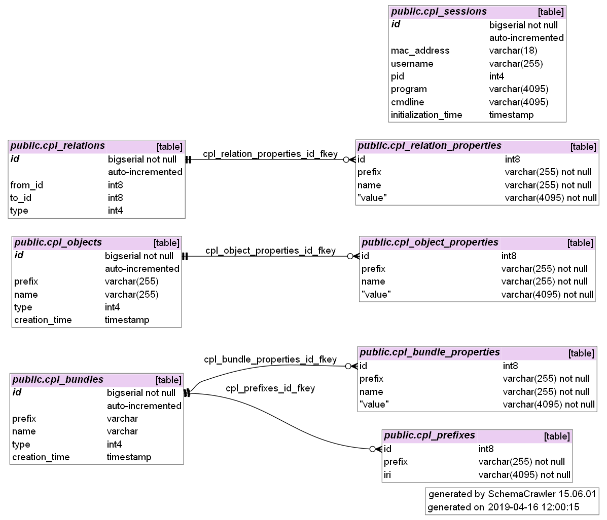
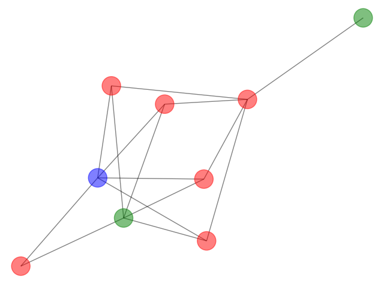
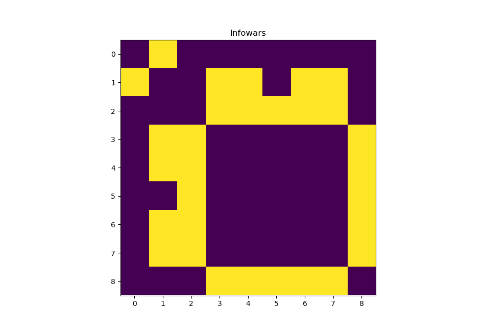

# Provenance Graphs for News Articles

## Table of Contents 
**1. Introduction<br/>
2. Installation <br/>
3. Database Schema <br/>
4. How to Run <br/>
5. Summary: Files <br/>
6. Summary: How to Run <br/>
7. Vaccine Case Study<br/>
8. Current Issues**

## Introduction
The original code was written by Ying-Ke Chin-Lee in 2017.
I worked on forks of this repo and https://github.com/jeanettejohnson/prov-cpl during a directed studies at UBC in Winter 2019.For more information on the concept of data provenance, check out [A Primer on Provenance](https://dl.acm.org/citation.cfm?id=2602651). The purpose of this module is to extract provenance from online news articles and to store and visualize it in a meaningful way--It attempts this by taking an article and generating a graph or matrix representing a collection of the authors, quotes, and linked articles related to the base article mapping the relationships between them. The ultimate goal is to address the question of whether provenance can be used to distinguish "Fake News" from real news. 

## Installation
In order to run the end-to-end pipeline to generate a provenance graph for an article, there are a few dependencies that need to be installed first. Here is a step-by-step guide to installing everything you'll need to run this project.

1. Clone this repository: `git clone https://github.com/jeanettejohnson/article-scraping.git`

2. Open in your text editor or IDE and begin to resolve dependencies in `scraper.py` and `graphbuilder.py`. **Do not attempt to resolve `provgenerator.py` dependencies yet**. You will need to install quite a few packages, including but not necessarily limited to:
	* pandas and numPy: These packages come built in with the Anaconda python distribution, which is easy to use. A guide can be found here: https://pandas.pydata.org/pandas-docs/stable/install.html. I used Anaconda for all the python 3 components of this project.
	* requests
	* textblob
	* lxml
	* nltk
	* json
	* collections
	
3. Download and install the Prov-CPL library and Python bindings, as well as their dependencies. My fork of library and the original installation instructions can be found here: https://github.com/jeanettejohnson/prov-cpl
	#### A few slight changes to the installation process
	* When configuring the database, run the command `sudo psql -U postgres postgres < scripts/postgresql-setup-article-prov.sql` rather than the default option. The database schema is slightly different for this project than is assumed by the original.
	* If you are having linking issues during compilation (and you are on unix), run `set LD_LIBRARY_PATH="/usr/local/lib"`. If this does not work, try setting it [like this](https://stackoverflow.com/questions/13428910/how-to-set-the-environmental-variable-ld-library-path-in-linux)
	
4. Start the PostgreSQL server you installed in step 3: `sudo /etc/init.d/postgresql start`. Verify that it says [OK] and accepts connections on port 5432 (or whichever port you configured it to listen on). 

5. (Optional) Download and install a PostgreSQL Database Visualizer. I like pgAdmin: https://www.pgadmin.org/. Connect to the running DB with username postgres and verify that the DB has been set up correctly and you can navigate between tables. There won't be anything there yet as you are running it locally.

6. `provgenerator.py` needs to be run using python 2, while the rest of the project depends on python 3/Anaconda. This is because provgenerator is the file with dependencies to prov-cpl, and the cpl python bindings strictly support 2.7. You will need to figure out a way to switch easily between the two Python builds. You can do this via command line with the python command linking to python 2.7 and the python3 command linking to python 3.7. My solution to this was to use PyCharm with WSL support, and run python 2 in a WSL interpreter and python 3 in the command line. This is definitely *not* the best approach and I don't recommend it, but it's a slightly easier way to get the CPL bindings to work.

## Database Schema
You will notice that cpl_bundles has no direct relationship to `cpl_objects`. In previous prov-cpl versions, each object belonged to a bundle. However, for this specific application where a "bundle" is an article and an "object" can be an author, quote, or link to another article, it did not make sense for objects to uniquely belong to one bundle (e.g. if Alice authored two InfoWars articles, there should be one "author: Alice" object in the database that belongs to the bundles "infowars article 1" and "infowars article 2"). To deal with this, bundles have become a special type of object and the relationship from bundle to objects is stored in the `cpl_relations` table. 


## How to Run
Here is a walkthrough of how to generate a prov graph, using [this InfoWars anti-vaccine article](https://www.infowars.com/mmr-vaccine-after-puberty-reduces-testosterone-sperm-counts-report/). A short summary of the relevant commands and files can be found below this section.
First, run the web scraper module to look at the article HTML and pull out relevant items such as authors, quotes, and links to other articles. 
```
python3 scraper.py https://www.infowars.com/mmr-vaccine-after-puberty-reduces-testosterone-sperm-counts-report/
```
The information will be written in JSON format to `articles.json`, which is overwritten on every run with old article info being saved to the `/oldarticles` directory. `articles.json` will contain information about the principle article and other articles that are directly referenced within the principle article. Here is a small sample of the format: 
```json
[
{
	"url":"https://www.infowars.com/mmr-vaccine-after-puberty-reduces-testosterone-sperm-counts-report/",
	 "title":"MMR Vaccine After Puberty Reduces Testosterone, Sperm Counts \u2013 Report",
	"authors":["Children's Health Defense"],
	"author_links":["http://childrenshealthdefense.org/news/vaccines/mmr-vaccines-poison-pill-mumps-after-puberty-reduced-testosterone-and-sperm-counts/"],
	"date":"April 4, 2019",
	"quotes":[],
	"names":[],
	"links":["https://childrenshealthdefense.org/news/failure-to-vaccinate-or-vaccine-failure-what-is-driving-disease-outbreaks/", "https://www.cdc.gov/mumps/outbreaks.html", "https://www.sun-sentinel.com/news/fl-xpm-1989-01-03-8901010337-story.html", "https://www.ncbi.nlm.nih.gov/pmc/articles/PMC6121553/", "https://www.ncbi.nlm.nih.gov/pubmed/20517181", "https://www.hopkinsmedicine.org/health/conditions-and-diseases/mumps-in-adults", "https://www.webmd.com/men/inflammation-testicle-orchitis#1", "https://www.ncbi.nlm.nih.gov/pmc/articles/PMC1633545/", "https://www.ncbi.nlm.nih.gov/pmc/articles/PMC1633545/", "https://academic.oup.com/humupd/article/23/6/646/4035689", "https://www.ncbi.nlm.nih.gov/pubmed/20517181", "https://www.merckvaccines.com/products/mmr/measles-mumps-rubella-vaccine-history", "http://wayback.archive-it.org/7993/20170723150912/https:/www.fda.gov/BiologicsBloodVaccines/Vaccines/ApprovedProducts/ucm123799.htm", "https://www.fiercepharma.com/infectious-diseases/lawsuits-claiming-merck-lied-about-mumps-vaccine-efficacy-headed-to-trial", "https://blogs.wsj.com/pharmalot/2015/06/08/merck-is-accused-of-stonewalling-over-effectiveness-of-mumps-vaccine/", "https://www.genengnews.com/a-lists/top-10-pharma-companies-of-2018/", "https://www.benzinga.com/analyst-ratings/analyst-color/18/11/12740354/merck-is-up-40-in-2018-whats-driving-the-rally", "http://probeinternational.org/library/wp-content/uploads/2014/09/chatom-v-merck.pdf", "https://www.justice.gov/sites/default/files/civil/legacy/2011/04/22/C-FRAUDS_FCA_Primer.pdf", "https://www.ncbi.nlm.nih.gov/pubmed/15950329", "https://www.huffingtonpost.ca/lawrence-solomon/merck-whistleblowers_b_5881914.html", "https://www.infowars.com/watch/?video=5c2fe1fbf6d3eb27147154a5", "https://www.sciencedirect.com/science/article/pii/S0264410X19302257", "https://www.ncbi.nlm.nih.gov/pubmed/30065192", "https://www.ncbi.nlm.nih.gov/pubmed/30065192", "https://www.sciencedirect.com/science/article/pii/S0264410X19302257", "https://www.ncbi.nlm.nih.gov/pubmed/30065192", "https://www.cdc.gov/mumps/outbreaks.html", "https://www.flickr.com/photos/ps_sahana/14194682140/in/photolist-nCkssY-9vH18f-9vHhZE-dZn4vR-9vRPEi-dZn4st-9vEwjn-dZsLsy-9vHuuj-dZsLxb-4Nu73F-dZn4yX-dZsM6G-dZn468-fqnzxX-7jzmJT-asyQfb-83cvde-83fDJ1-9sk21X-xgHefX-4RyPa4-6vHWT9-5HN2B4-EWByq5-qQ2H1k-9NQy5a-9NQye2-9NQw82-UiQGtm-nzKy5D-eh2QnG-7cphs9-dCBPSD-9NTkCs-eh2QgQ-eh2R9S-rcsZV8-gwmAC2-qQGgak-9NQvGp-9NQvQn-p4GcEM-egW1Pp-9NTjnU-9NQwpz-9NQxKv-9NQxjr-9NTjwN-9NTmom", "https://medicalxpress.com/news/2016-12-mumps-college-campuses.html", "https://www.huffpost.com/entry/mumps-outbreak-at-harvard-why-do-vaccinated-people-get-sick_n_57276bc7e4b0b49df6abc402", "https://www.usnews.com/news/best-states/pennsylvania/articles/2019-03-27/the-latest-over-2k-get-vaccine-booster-amid-mumps-outbreak", "https://www.society19.com/what-to-know-about-the-syracuse-university-mumps-outbreak/", "https://www.nola.com/health/2017/03/lsu_loyola_report_mumps_cases.html", "https://www.usnews.com/news/best-states/indiana/articles/2019-03-13/3rd-indiana-university-student-diagnosed-with-mumps", "https://medicalxpress.com/news/2016-12-mumps-college-campuses.html", "https://newyork.cbslocal.com/2016/08/02/health-officials-urge-caution-as-18-young-adults-are-diagnosed-with-mumps-in-long-beach/", "https://www.businessinsider.com/uss-fort-mchenry-sailors-are-still-falling-ill-in-viral-mumps-outbreak-2019-3", "https://childrenshealthdefense.org/news/failure-to-vaccinate-or-vaccine-failure-what-is-driving-disease-outbreaks/", "https://www.thenewstribune.com/news/politics-government/article226045540.html", "https://www.infowars.com/watch/?video=5ca3ea59be0c561e93cca9a6", "/newsletter-sign-up/", "https://www.infowarsstore.com/support-infowars/donations.html", "https://play.google.com/store/apps/details?id=com.infowars.official"],
	"sentiments":[],
	"num_flags":0,
	"cite_text":["responding", "thousands", "relatively harmless", "no symptoms", "adverse effects", "inflammation", "orchitis", "one in three post-pubertal men who get mumps", "infertility", "significant declines", "delays onset of disease", "Merck", "2005", "monopoly position", "over $720 million", "top five", "seven-year high", "lawsuit", "False Claims Act", "69%", "fraudulent activities", "vaccines in America.", "durability", "postponed the onset", "median age", "size and number", "complications", "150 outbreaks", "Flickr", "college campuses", "Harvard", "Temple", "Syracuse", "Louisiana State", "Indiana", "University of Missouri", "comeback", "unable to come ashore", "noted", "mandates", "hypocrisy of the left.", "\\n\\t\\t\\n\\t", "\\n\\t\\t\\n\\t", "\\n\\t\\t\\n\\t"]
}
]
```
Next, run **`python provgenerator.py`** using python 2.7. This module uses the prov-cpl library to create provenance entities and map relationships between them. It reads from `articles.json` and produces `output.json`. `output.json` follows the Prov-JSON syntax, documentation for which can be found here: https://www.w3.org/Submission/2013/SUBM-prov-json-20130424/. `output.json` will have a list of provenance objects followed by an enumeration of the relationships between them, and will look something like this:

```json
"{\"activity\":
	{\"demo:QUOTE 0\":
		{\"demo:quote\":\"\\\"Well, I\\\\'ll tell you, I pray that it doesn\\\\'t get to that. I pray it doesn\\\\'t get to that.\\\"\"}},
\"agent\":
	{\"demo:AUTHOR 0\":
		{\"demo:author\":\"Children's Health Defense\"}
\"entity\":
	{\"demo:ARTICLE 0\":
		{\"demo:url\":\"https://www.infowars.com/mmr-vaccine-after-puberty-reduces-testosterone-sperm-counts-report/\"},
	\"demo:ARTICLE 1\":
		{\"demo:url\":\"http://www.infowars.com/watch/?video=5c2fe1fbf6d3eb27147154a5\"}
\"inBundle\":
	{\"78758\":
		{\"prov:bundle\":\"https://www.infowars.com/mmr-vaccine-after-puberty-reduces-testosterone-sperm-counts-report/\",
		 \"prov:object\":\"demo:ARTICLE 0\"},
	\"78760\":
		{\"prov:bundle\":\"https://www.infowars.com/mmr-vaccine-after-puberty-reduces-testosterone-sperm-counts-report/\",
		\"prov:object\":\"demo:AUTHOR 0\"},
	\"78764\":
		{\"prov:bundle\":\"https://www.infowars.com/mmr-vaccine-after-puberty-reduces-testosterone-sperm-counts-report/\",
		\"prov:object\":\"demo:ARTICLE 1\"},
	\"78770\":
		{\"prov:bundle\":\"https://www.infowars.com/mmr-vaccine-after-puberty-reduces-testosterone-sperm-counts-report/\",
		\"prov:object\":\"demo:QUOTE 0\"},
\"wasAttributedTo\":
	{\"78762\":
		{\"prov:agent\":\"demo:AUTHOR 0\",
		\"prov:entity\":\"demo:ARTICLE 0\"}},
\"wasDerivedFrom\":
	{\"78834\":
		{\"prov:generatedEntity\":\"demo:ARTICLE 0\",
		\"prov:usedEntity\":\"demo:ARTICLE 1\"}},
\"wasGeneratedBy\":{
	\"78772\":
		{\"prov:activity\":\"demo:QUOTE 0\",
		\"prov:entity\":\"demo:ARTICLE 1\"}}}"
```
Finally, visualize the graph: **`python graphbuilder.py`**
The graph builder will read the prov-JSON from `output.json` and display an undirected network graph where nodes represent quotes, articles, and authors and edges between them represent provenance relationships. Here is the graph for the infowars vaccine article:

**Key:**
- blue: quote
- green: author
- red: article
- purple: sentiment



The graphbuilder can also generate NumPy matrices. Here is the matrix representation of this article:


## Summary: File list
* ```scraper.py```
  * program that does the scraping
  * outputs ```articles.json```
  * uses Python 3
* ```provgenerator.py```
  * input is ```articles.json```
  * outputs ```output.json```
  * since cpl-prov uses Python 2, uses python 2 as well
* ```graphbuilder.py```
  * input is ```output.json``` 
  * output is a networkx graph
  * uses Python 3

## Summary: How to run
* ```python3 in_progress.py [url of article]```
* ```python graph2.py```
* ```python3 upload.py```

## Case study: Vaccine articles
I found it helpful to generate & compare graphs for these recent articles from varied sources on the topic of the "anti-vaxxination" movement and the resurgence of measles.
- https://www.cnn.com/2019/04/15/health/measles-2019-us-global-cdc-who-bn/index.html
- https://www.bbc.com/news/health-46972429
- https://www.bbc.com/news/av/health-45301399/why-is-there-a-measles-outbreak-in-europe
- https://www.chicagotribune.com/suburbs/naperville-sun/news/ct-nvs-vaccine-push-st-0317-story.html
- https://www.breitbart.com/tech/2019/03/22/report-instagram-blacklists-anti-vaccine-hashtags-following-facebook-youtube-crackdowns/
- https://www.infowars.com/watch/?video=5cae7568b021b7001c3153eb
- https://www.infowars.com/mmr-vaccine-after-puberty-reduces-testosterone-sperm-counts-report/

## Current issues
* check out root sentiment
* comparing sentiment of paragraph to quote
  * not sure it will actually be accurate
* linked vs unlinked quotes
* labeled corpus
* get all objects option
* update database setup script
